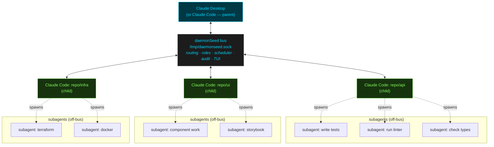

# daemonSeed

A **tiny local control plane** for Claude Code: a lightweight, local-only
message broker that lets a **Parent** Claude Code instance orchestrate one or
more **Child** instances across repos and terminals — over a Unix domain
socket, through MCP tools.

The daemon is the control plane in the real sense: it owns the authoritative
state (client registry, roles, task queues, schedules, inboxes), enforces
policy (one-parent rule, role permissions, limits), and executes intent over
time (the scheduler fires whether or not a parent is connected). The parent
is a **replaceable controller** — think `kubectl` with admin credentials, not
the API server. That's what makes parent failover (below) possible.



> **Note on subagents:** each child Claude Code instance spawns its own
> subagents as usual — those subagents are **not** on the bus. They are
> internal to the child. The parent still learns what they accomplished
> because the child reports upward (`bus_report_status`,
> `bus_complete_task`) and the parent can ask at any time
> (`bus_get_status`). One bus connection per repo, not per agent.

- **Local only.** Unix domain socket (`0600`), no network exposure, ever.
- **Single parent, with failover.** Exactly one parent at a time — but the
  slot re-arbitrates: a crashed parent's successor inherits everything the
  children said in the meantime.
- **Accountability first.** Every routed message lands in a JSONL audit log,
  and a session trace records who talked to whom, when, and how long tools
  took.
- **Graceful by default.** Shutdown is a cascade — children are notified,
  acknowledged, and never abandoned.
- **Schedules live in the daemon.** Cron, interval, and one-shot tasks fire
  even when the parent session is closed.

## Quickstart

```bash
# 1. Build & install (puts daemonseed in ~/.local/bin)
./scripts/install.sh

# 2. Start the daemon
daemonseed start --background

# 3. Wire up the parent repo
cp .mcp.json.parent.example /path/to/parent-repo/.mcp.json

# 4. Wire up each child repo (give each a unique name)
cp .mcp.json.child.example /path/to/child-repo/.mcp.json

# 5. (optional) Install slash commands
daemonseed install-commands --repo-path /path/to/parent-repo --role parent
daemonseed install-commands --repo-path /path/to/child-repo --role child

# 6. Watch the bus live
daemonseed tui
```

Open Claude Code in each repo. The parent can now `bus_broadcast` work, the
children `bus_report_status` back, and the whole fleet shuts down cleanly via
`bus_shutdown`.

## CLI

```
daemonseed start [--tui] [--background] [--pidfile PATH]   Start the daemon
daemonseed stop                                            Graceful stop (SIGTERM via PID file)
daemonseed status                                          Daemon status, clients, and schedules
daemonseed mcp --role parent|child --name NAME [--auto-start]
daemonseed tui                                             Attach dashboard to a running daemon
daemonseed install-commands --repo-path PATH --role ROLE [--force]
daemonseed install-hooks --repo-path PATH --name NAME      Install the inbox hook in a child repo
daemonseed inbox --name NAME [--drain]                     Show/clear a child's pending bus messages
daemonseed logs [-f] [-n N]                                Show/tail the audit log
daemonseed trace [-n N] [--session X] [--trace-id ID]      Show recent session trace events
daemonseed version

Global flags: --config PATH  --socket PATH  --log-level LEVEL  --log-format json|text
```

## MCP tools

| Tool | Role | Purpose |
|---|---|---|
| `bus_list_children` | parent | List connected children |
| `bus_send` | parent | Direct message to a child |
| `bus_broadcast` | parent | Message all children |
| `bus_assign_task` | parent | Assign a structured task |
| `bus_get_status` | parent | Synchronous status request |
| `bus_shutdown` | parent | Graceful shutdown cascade |
| `bus_remove_child` | parent | Disconnect one child |
| `bus_schedule_task` | parent | Schedule a task (cron / interval / one-shot) |
| `bus_list_schedules` | parent | List schedules with next fire time |
| `bus_cancel_schedule` | parent | Cancel a schedule |
| `bus_report_status` | child | Push status to the parent |
| `bus_send_to_parent` | child | Direct message to the parent |
| `bus_get_assignment` | child | Poll for a pending task |
| `bus_acknowledge_task` | child | Acknowledge a task |
| `bus_complete_task` | child | Report task completion |
| `bus_ping` | all | Daemon roundtrip time |
| `bus_whoami` | all | This instance's identity |
| `bus_list_all` | all | All connected clients |
| `bus_check_messages` | all | Drain messages received since last check |

Role restrictions are enforced **by the broker**, not just by tool
availability — a crafted raw-socket message from the wrong role is rejected
with `PERMISSION_DENIED`.

## Scheduling tasks (spec §20.8)

The parent can schedule work for children — the schedule lives in the
**daemon**, so it fires even after the parent's Claude session closes.
From the parent session, just ask Claude:

> "Schedule the dependency audit on `api` nightly at 2am."

Claude calls `bus_schedule_task` with one of three trigger shapes:

```json
{"at":    "2026-06-10T02:00:00Z"}    // one-shot
{"every": "15m"}                     // fixed interval
{"cron":  "0 2 * * *"}               // standard 5-field cron
```

When a schedule fires, the daemon queues a normal task for the child
(`bus_get_assignment` picks it up) and pushes it if the child is connected.
If the child is **offline** at fire time, the per-schedule `misfire` policy
decides: `queue` (default — delivered on reconnect, expiring after `ttl`)
or `skip` (occurrence dropped and logged).

Manage schedules with `bus_list_schedules` / `bus_cancel_schedule`, or watch
them from the shell:

```bash
daemonseed status        # shows each schedule, its next fire time, fire count
```

Guardrails: minimum interval 60s (`limits.min_schedule_interval_seconds`),
at most 50 schedules (`limits.max_schedules`), every fire audited. Schedules
are in-memory in this version — a daemon restart drops them (durable bbolt
storage is the planned follow-up, spec §20.1).

## Surfacing parent messages in child sessions (spec §20.7)

A child's Claude session normally only sees bus traffic when it polls
(`bus_check_messages`, `bus_get_assignment`). The **inbox hook** closes that
gap: it injects pending parent messages into the child's session
automatically, as context, on every prompt.

```bash
# one-time setup, per child repo
daemonseed install-hooks --repo-path /path/to/child-repo --name api
```

This adds a `UserPromptSubmit` hook to the repo's `.claude/settings.json`
that runs `daemonseed inbox --drain --name api`. From then on, anything the
parent sent since the last turn shows up in the child's context:

```
[daemonSeed] message from orchestrator (DIRECT_MESSAGE): please rebase on main
[daemonSeed] pending task auth-001 (call bus_get_assignment / bus_acknowledge_task): extract auth module
```

**Slash commands are deny-by-default.** If the parent sends a message
starting with `/`, the hook only passes it through as an executable request
when it's allowlisted in the child's config:

```yaml
# ~/.config/daemonseed/config.yaml
commands:
  allow_from_parent: ["/bus-report", "/bus-whoami"]
```

Non-allowlisted commands are surfaced as *blocked* (with a note on how to
allow them) and the refusal is logged — parent-to-child command execution is
remote code execution by design, so it's opt-in per command. The hook also
fails soft: if the daemon is down, it prints nothing and your session is
unaffected.

## Parent failover (spec §20.9)

Because the daemon holds all the state, a parent session is disposable.
If the parent crashes or you simply close the terminal:

- **Children keep working.** They're notified (`parent disconnected`) but
  their tasks, queues, and schedules are untouched.
- **Nothing they say is lost.** Status reports, task acknowledgments,
  completions, and messages to the absent parent are buffered in the daemon
  (bounded queue, oldest dropped first); the child gets a receipt marked
  `queued` instead of an error.
- **The next parent inherits the backlog.** Open a new Claude Code session
  with the parent MCP config — same repo or anywhere else — and it receives
  everything that happened while the seat was empty, in order, followed by a
  `parent connected` notice to the children.

No commands to run; it's just how the bus behaves.

## Session tracing (spec §20.10)

daemonSeed keeps a local, OTel-flavored trace of the whole session — every
**MCP tool invocation** (from every instance, with duration) and every
**parent↔child communication**, timestamped and correlated by `trace_id` so
you can follow one request/response chain across processes. Payloads are
**truncated** (default 200 chars) — these are logs worth having, not a copy
of every message body. The audit log remains the full delivery record;
the trace is the observability view.

```bash
daemonseed trace                          # last 50 events
daemonseed trace -n 200 --session api     # one child's activity
daemonseed trace --trace-id 550e8400      # follow one exchange
daemonseed trace --kind tool              # only MCP tool calls
```

Sample output:

```
14:02:11.482  tool      bus_assign_task        orchestrator(parent) 3.2ms  {"target":"api","task_json":"…"}
14:02:11.484  message   ASSIGN_TASK            orchestrator→api trace=7c33ab12  {"task_id":"auth-001",…
14:02:14.107  tool      bus_report_status      api(child) 1.9ms  {"message":"3 files done","state":"working"}
14:02:14.108  message   STATUS_REPORT          api→orchestrator trace=9d01f2aa  {"state":"working",…
```

**This can get big — so SQLite is built in.** The default backend is JSONL
(append-only, size-rotated). Flip one config line and traces go into a local
SQLite database (pure-Go `modernc.org/sqlite`, WAL mode, safe for the daemon
and several MCP processes writing at once, indexed by time/session/trace id):

```yaml
trace:
  enabled: true
  backend: sqlite        # default: jsonl
  path: ~/.local/share/daemonseed/trace.jsonl   # sqlite auto-swaps to trace.db
  max_detail_chars: 200
```

Tracing never slows the bus: events flow through a bounded async queue and
are dropped (and counted) under backpressure rather than blocking routing.

## Configuration

Default location: `~/.config/daemonseed/config.yaml` (see the full annotated
example in `testdata/configs/valid_config.yaml`). Every value can be
overridden with `DAEMONSEED_<SECTION>_<KEY>` environment variables, e.g.
`DAEMONSEED_DAEMON_SOCKET_PATH=/var/run/ds.sock`.

Defaults: socket `/tmp/daemonseed.sock`, 1 MB max message, 20 clients max,
5s handshake timeout, 10s status timeout, 45s stale-client timeout, audit log
at `~/.local/share/daemonseed/audit.jsonl` (payload content **not** logged
unless `audit.log_payloads: true`).

## Development

```bash
make build          # bin/daemonseed
make test           # go test -race ./...
make coverage       # coverage.html
make lint           # golangci-lint
```

Go 1.24+ required. The test suite passes `go test -race ./...` with zero
goroutine leaks (verified with goleak).

## Design notes & documented spec decisions

The implementation follows `spec/daemonSeed_spec.md` (v1.0.0-spec). Where the
spec left a choice open, the decision is documented in code and here:

- **Duplicate child names are rejected** at handshake (not auto-disambiguated)
  so a name always identifies exactly one session.
- **Future client versions are accepted with a logged warning**, not rejected;
  the wire format is versioned per-envelope.
- **Correlation:** the spec's synchronous flows (receipts, status requests,
  daemon queries) need request/response matching, so envelopes carry an
  optional `correlation_id` field and the broker answers daemon-addressed
  queries (`LIST_REQUEST`, `WHOAMI_REQUEST`, `GET_ASSIGNMENT_REQUEST`,
  `SHUTDOWN_REQUEST`, `REMOVE_CHILD_REQUEST`) with correlated responses
  (`DELIVERY_RECEIPT`, `LIST_RESPONSE`, …). These are documented extensions in
  `internal/protocol/types.go`.
- **Observer role** (internal, not exposed via MCP): read-only event-stream
  connections used by `daemonseed tui` and `daemonseed status`.
- **Oversized messages**: the broker drains the oversized frame, replies
  `MESSAGE_TOO_LARGE`, and keeps the connection alive.
- **`bus_check_messages`** (extension tool): the spec gives children no way to
  read pushed broadcasts/direct messages, so the MCP buffers them for explicit
  draining.
- **Parent disconnect** notifies children with a `DIRECT_MESSAGE` from
  `daemon` whose payload is `parent disconnected`.
- **Task queues are keyed by child name**, not connection, so pending tasks
  survive a child reconnect (and back the scheduler's `queue` misfire policy).
- **Child→parent traffic while no parent is connected is queued, not failed**
  (§20.9): the receipt carries `queued: true`, and the next parent inherits
  the backlog. Correlated status replies are the exception — their requester
  is gone.
- **Trace vs audit**: the audit log is the complete delivery record (per
  spec §14); the session trace is the observability view — truncated
  payloads, tool durations, correlation chains — and may drop events under
  backpressure by design.
- **Cron parsing is in-house** (`internal/cron`, standard 5-field semantics
  including the dom/dow either-matches quirk): the build environment had no
  network access to vendor `robfig/cron`, and the package is interface-
  compatible enough to swap later.

## Inspiration

daemonSeed is a deliberately **lightweight** take on ideas you'll find in
bigger multi-agent orchestrators like
[Multica](https://github.com/multica-ai/multica) and
[OpenAI Symphony](https://github.com/openai/symphony) on GitHub.
The goal here was narrower and more personal: improve a day-to-day **Claude
Code** working environment with something **self-hosted**, trivial to start
(`daemonseed start --background` and you're done), and built on the simplest
possible integration surface — **MCP** over a local Unix socket. No cloud,
no fleet of services, no framework — honestly, just a **tiny local control
plane**: one small daemon that owns the state, one replaceable parent, some
children. Oh -- and a small TUI if you need it.

## Security model

Local-only by construction: the broker binds a `0600` Unix socket and the
codebase contains no TCP/HTTP client or listener. No auth tokens in v1.0 —
the OS socket permission is the boundary (see spec §15 for the planned
multi-user extension).

## License

[MIT](LICENSE)
